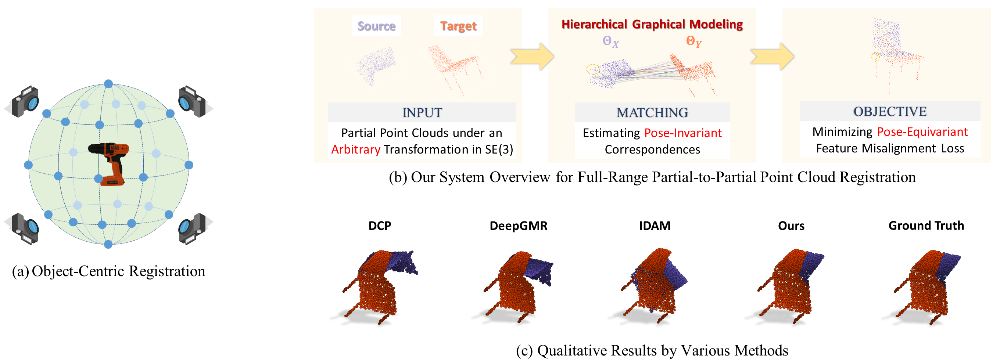
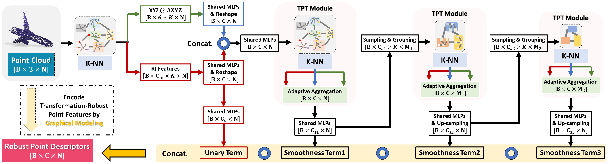

# *GMCNet:* Robust Partial-to-Partial Point Cloud Registration in a Full Range
<p align="center"> 

</p>

## [GMCNet]
Many researchers use handcrafted rotation-invariant (*RI*) features to facilitate point cloud registration (PCR), and many other researchers choose not to use *RI* features as they think *RI* features require consistent observations or correct surface normal.  

In this work, we study on using variaous handcrafted features that are computed on-the-fly for PCR, and prove that they could improve PCR even under arbitraty transformations in the full SE(3).  The synergy between a local transformer (attention-based) and a hierarhical architecture further improve the PCR performance.

This repository contains the PyTorch implementation of the paper:

**Robust Partial-to-Partial Point Cloud Registration in a Full Range**

[[arxiv](https://arxiv.org/abs/2111.15606)]

> Point cloud registration for 3D objects is very challenging due to sparse and noisy measurements, incomplete observations and large transformations. In this work, we propose Graph Matching Consensus Network (GMCNet), which estimates pose-invariant correspondences for fullrange 1 Partial-to-Partial point cloud Registration (PPR). To encode robust point descriptors, **1)** we first comprehensively investigate transformation-robustness and noiseresilience of various geometric features. **2)** Then, we employ a novel Transformation-robust Point Transformer (TPT) modules to adaptively aggregate local features regarding the structural relations, which takes advantage from both handcrafted rotation-invariant (RI) features and noise-resilient spatial coordinates. **3)** Based on a synergy of hierarchical graph networks and graphical modeling, we propose the Hierarchical Graphical Modeling (HGM) architecture to encode robust descriptors consisting of i) a unary term learned from RI features; and ii) multiple smoothness terms encoded from neighboring point relations at different scales through our TPT modules. Moreover, we construct a challenging PPR dataset (MVP-RG) with virtual scans. Extensive experiments show that GMCNet outperforms previous state-of-the-art methods for PPR. Notably, GMCNet encodes point descriptors for each point cloud individually without using crosscontextual information, or ground truth correspondences for training.

<p align="center"> 

</p>

### Installation
Install [Anaconda](https://docs.anaconda.com/anaconda/install/index.html), and then use the following command:
```
git clone https://github.com/paul007pl/GMCNet
cd GMCNet; source setup.sh;
```
If your connection to conda and/or pip is unstable, it is recommended to follow the setup steps in `setup.sh`.


### Data
Please download our prepared data ([Dropbox](https://www.dropbox.com/sh/tdfs406baoyugda/AADe8GV3w7CaORUDO6nCnRSra?dl=0)) to the folder `data`.


### Usage
+ To train a model: run `python train.py -c *.yaml`, e.g. `python train.py -c pcn.yaml`
+ To test a model: run `python test.py -c *.yaml`, e.g. `python test.py -c pcn.yaml`
+ Config for each algorithm can be found in `cfgs/`.
+ `run_train.sh` and `run_test.sh` are provided for SLURM users. 


## [Citation]
If you find our code useful, please cite our paper:
```bibtex
@article{pan2021robust,
  title={Robust Partial-to-Partial Point Cloud Registration in a Full Range},
  author={Pan, Liang and Cai, Zhongang and Liu, Ziwei},
  journal={arXiv preprint arXiv:2111.15606},
  year={2021}
}
```


## [License]
Our code is released under Apache-2.0 License.


## [Acknowledgement]
Part of code are borrowed from [DeepGMR](https://github.com/wentaoyuan/deepgmr), [RPMNet](https://github.com/yewzijian/RPMNet) and [DCP](https://github.com/WangYueFt/dcp).
Please also consider citing their paper.